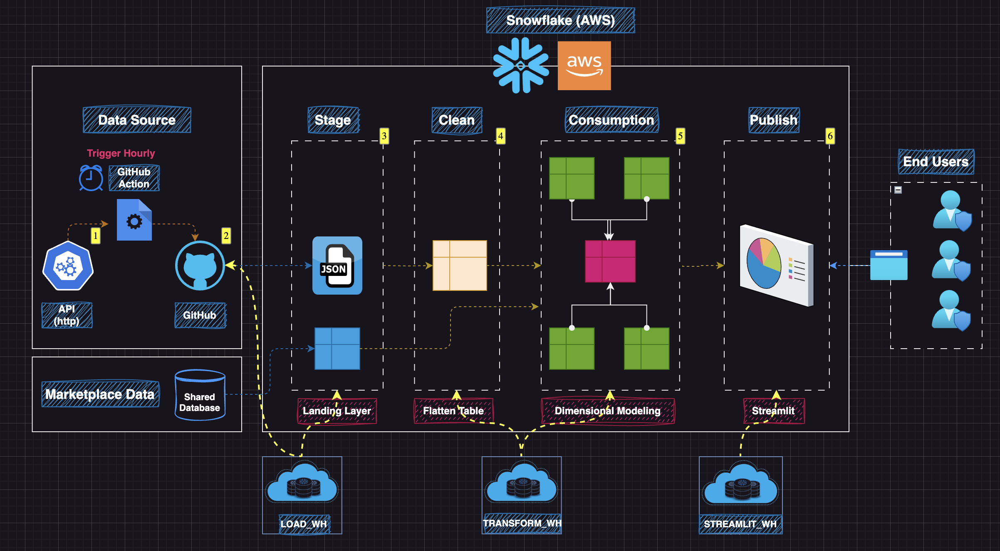

# Air Quality Index (AQI) Monitoring Pipeline - Snowflake | Streamlit | GitHub Action (CI/CD)

  

**Transforming Air Quality Insights**: A fully automated end-to-end data pipeline and interactive dashboard suite for monitoring AQI across 500+ stations in India, built with Snowflake, Snowpark, Python, GitHub Actions, and Streamlit.

---

## Project Overview

This repository hosts an end-to-end data engineering project that ingests, processes, and visualizes real-time Air Quality Index (AQI) data from [data.gov.in](https://www.data.gov.in/). Deployed on Snowflake, it features automated ETL workflows, dimensional modeling, and five interactive Streamlit applications for comprehensive air quality analysis across India.

### Key Features
- **Robust Data Pipeline**: Multi-layered architecture (Stage, Clean, Consumption, Publish) for seamless data flow.
- **Automation**: Hourly ingestion via GitHub Actions and 45-minute refreshes with Snowflake Tasks.
- **Dimensional Modeling**: Star Schema with fact, dimension, and pre-aggregated tables.
- **Interactive Dashboards**: Five Streamlit apps for diverse AQI insights.

### Tech Stack
- **Snowflake (AWS)**: Cloud data platform with Snowpark, Tasks, and Dynamic Tables.
- **Python**: Snowpark, Pandas for ingestion/processing; Streamlit for visualization.
- **GitHub Actions**: CI/CD automation for real-time data fetching.
- **REST API**: Data source ([data.gov.in](https://www.data.gov.in/)).
- **Streamlit**: Dashboards hosted on Streamlit Cloud and Snowflake.

---

## Project Highlights

- **1️ Robust Data Pipeline Architecture**  
  - **Multi-Layered Design**:
    - **Stage Layer**: Ingests raw, semi-structured JSON data from APIs.
    - **Clean Layer**: Processes, deduplicates, and normalizes data into structured tables.
    - **Consumption Layer**: Prepares data for advanced analytics and visualization.
  - **Automation**:
    - Implements automated ETL workflows using Snowflake Dynamic Tables, Task Scheduling, and `COPY INTO` commands.
    - Ensures seamless data flow with SQL-based validation and transformation, eliminating manual intervention.

- **2️ Dimensional Modeling and Aggregation**  
  - **Star Schema**:
    - **Fact Table**: Stores hourly AQI measurements and pollutant details.
    - **Dimension Tables**: Includes `DATE_DIM` and `LOCATION_DIM` for descriptive context.
  - **Aggregation**:
    - Generates hourly, city-level, and daily AQI trends for multi-granularity insights.
    - Optimizes querying with pre-aggregated tables for reporting efficiency.

- **3️ Interactive Visualization (Streamlit + Snowflake)**  
  - Hosts dynamic Streamlit apps on Snowflake for real-time data interaction.
  - **Key Features**:
    - **Hourly AQI Trends**: Displays trends via interactive line and bar charts.
    - **Pollutant Analysis**: Highlights AQI levels and key pollutants by city.
    - **Map Integration**: Maps stations using latitude/longitude with AQI values.
    - **Custom Filters**: Enables filtering by state, city, station, and date.

- **4️ Automation & Real-Time Updates**  
  - Integrates GitHub Actions for real-time API data ingestion.
  - Fully automates the pipeline, ensuring uninterrupted data flow without manual oversight.

---

## Snowflake Database Structure
The database (DEV_DB) is organized into multiple schemas:

**STAGE_SCH**:

    - Tables:
        - RAW_AQI: Stores raw JSON data.
        - RAW_STG: Staging table for ingested JSON.

**File Formats**:

    - JSON_FILE_FORMAT: Defines JSON format for ingestion.

**CLEAN_SCH**:

    - Dynamic Tables:
        - CLEAN_AQI_DT: Transforms JSON to row format (Target Lag: Downstream).
        - CLEAN_FLATTEN_AQI_DT: Flattens rows into columns (Target Lag: Downstream).

**CONSUMPTION_SCH**:

    - Dynamic Tables:
        - AGG_CITY_FACT_DAY_LEVEL: Aggregated daily city-level AQI.
        - AGG_CITY_FACT_HOUR_LEVEL: Aggregated hourly city-level AQI.
        - AGG_DELHI_FACT_DAY_LEVEL: Aggregated daily AQI for Delhi with weather data.
        - AQI_FINAL_WIDE_DT: Wide table with prominent pollutant and AQI (Target Lag: 30 mins).
        - DATE_DIM: Date dimension table (Target Lag: 30 mins).
        - LOCATION_DIM: Location dimension table (Target Lag: 30 mins).
        - AIR_QUALITY_FACT: Fact table for hourly AQI measurements (Target Lag: 30 mins).

## Pipeline Workflow
### Architecture Overview
The pipeline follows a multi-layered architecture on Snowflake (AWS), as depicted in the architecture diagram:

 

1. **Data Source**:
    - API (data.gov.in): Hourly JSON data (1.2 MB/file, 100 KB compressed, ~85K records/day).
    - Marketplace Data: Shared datasets (e.g., weather data).
    - Trigger: GitHub Action triggers hourly ingestion.

2. **Stage (Landing Layer)**:
    - Schema: STAGE_SCH.
    - Process: JSON data ingested via GitHub Action into RAW_STG, then loaded to RAW_AQI using COPY INTO.
    - Warehouse: LOAD_WH.

3. **Clean (Flatten Table Layer)**:
    - Schema: CLEAN_SCH.
    - Process: Transforms JSON to tabular format (CLEAN_AQI_DT, CLEAN_FLATTEN_AQI_DT).
    - Warehouse: TRANSFORM_WH.
    - Rules: Replace “NA” with 0.

4. **Consumption (Dimensional Modeling)**:
    - Schema: CONSUMPTION_SCH.
    - Process: Star Schema with fact (AIR_QUALITY_FACT) and dimensions (DATE_DIM, LOCATION_DIM).
    - Aggregates: AGG_CITY_FACT_HOUR_LEVEL, AGG_CITY_FACT_DAY_LEVEL, AGG_DELHI_FACT_DAY_LEVEL.
    - Warehouse: TRANSFORM_WH.

5. **Publish (Streamlit)**:
    - Schema: PUBLISH_SCH.
    - Process: Tables/views for visualization.
    - Warehouse: STREAMLIT_WH.

6. **End Users**:
    - Access dashboards for real-time AQI insights.

## Streamlit Applications
1. **Location App**:
    - Features: Station-level AQI, map integration, filters (state, city, station, date).
    - Visuals: Interactive maps, bar charts.

 

2. **Day Level AQI for Cities**:
    - Features: Daily AQI trends by city.
    - Visuals: Line charts.

 

3. **Hourly AQI Trend for City**:
    - Features: Hourly AQI trends for selected cities.
    - Visuals: Line/bar charts.

4. **Air Quality Trend - City + Day Level**:
    - Features: Combined city and daily AQI analysis.
    - Visuals: Line charts with filters.

 

5. **New Delhi AQI Trend with Temp**:
    - Features: AQI and weather data for New Delhi.
    - Visuals: Dual-axis charts.

 

## Conclusion

This project successfully delivers a robust, automated, and scalable solution for monitoring the Air Quality Index (AQI) across 500+ stations in India. By leveraging Snowflake's cloud data platform, GitHub Actions for real-time ingestion, and Streamlit for interactive visualization, it provides actionable insights into air quality trends through six dynamic dashboards. The multi-layered architecture ensures efficient data processing, while the automation eliminates manual intervention, making it a reliable system for continuous monitoring. This pipeline not only demonstrates modern data engineering practices but also lays a strong foundation for future enhancements, such as integrating additional data sources or expanding to other environmental metrics.

## Contributing

Contributions are welcome! If you'd like to improve the project or fix issues, feel free to open a pull request.

## Contact

For questions or suggestions, please contact [Kaushik Rohida](mailto:rohidakaushik@gmail.com).